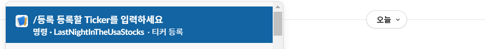
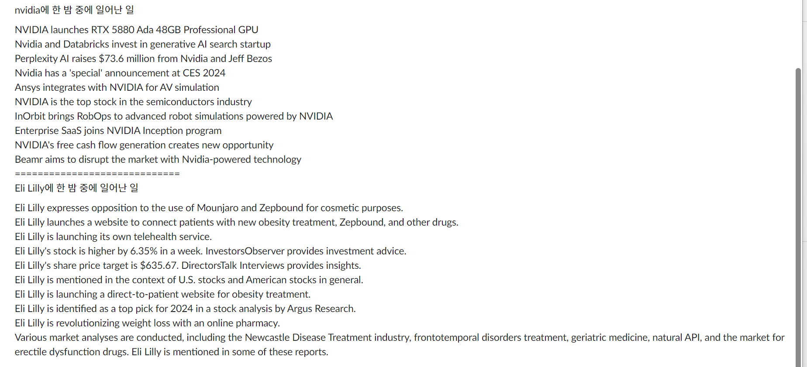

# i-know-what-you-did-last-night-in-the-usa-stocks

## 니즈

- 미국 종목은 어떤 일들이 일어났는지 팔로잉 하기가 힘들다
  - 새벽에 일들이 일어남
  - 영어다
  - 해당 종목에 대해 언급하는 인물들은 외국인이 많다
- 뭐야 왜떨어졌어, 왜 올랐어 깜짝 놀라는 경우가 있고, 이유를 찾아보기 쉽지 않고 찾기 귀찮다
- 그냥 뭐 찾아보기 귀찮다 근데 팔로잉은 하고싶음
- 팔로잉 하고 있던 애들 까먹는다

## 기능

- 슬랙 봇을 이용해 팔로잉 할 종목을 설정
  

- 팔로잉 하고 있는 종목들의 그 날 있었던? 일들을 정리해서 메세지 푸시 한다
  

## 시스템 설계

- 수집, 분석 서버

  - Nest js 서버
  - 팔로잉된 종목들의 뉴스데이터를 수집
  - 수집한 뉴스데이터를 요약

- 서비스 API

  - 사용자 관리
  - 구독 관리

- slack bot 서버
  - 사용자와의 interaction을 위한 서버
  - 구독할 티커를 받고 등록
  - 구독하고 있는 주식의 요약 뉴스를 푸시
